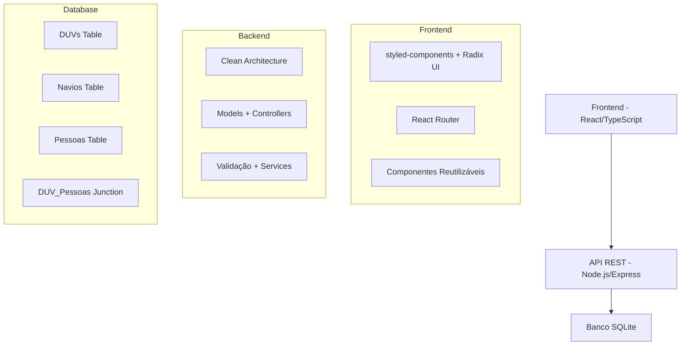

# Sistema de Gerenciamento de DUVs - Seals Solutions 2025

> **Processo Seletivo 2025** - Desafio Técnico FullStack  
> Desenvolvimento de sistema para gerenciamento de **Documentos Únicos Virtuais (DUVs)** de viagens marítimas

## 🎯 **IMPORTANTE - DOIS SISTEMAS DESENVOLVIDOS**

Para demonstrar versatilidade técnica e domínio de diferentes stacks, desenvolvi **2 sistemas completos**:

### 📦 **Sistema 1 - Este Repositório (React + styled-components)**
- **Frontend**: React 18 + TypeScript + styled-components + Radix UI
- **Backend**: Node.js + Express + SQLite
- **Foco**: Clean Architecture, componentização avançada, sistema de design customizado

### 🚀 **Sistema 2 - Next.js Stack Moderna**
- **Repositório**: [https://github.com/WedsonTavares/Sistema-DUV-2.git](https://github.com/WedsonTavares/Sistema-DUV-2.git)
- **Frontend**: Next.js 14 + TypeScript + TailwindCSS + Shadcn/ui
- **Backend**: Next.js API Routes + Prisma + SQLite
- **Foco**: Performance, SEO, componentes modernos, design system Shadcn

**Ambos os sistemas atendem 100% aos requisitos do desafio técnico!** 🎉

## 🚢 Visão Geral

Sistema fullstack completo que atende todos os requisitos do processo seletivo da Seals Solutions 2025. Implementa gerenciamento integrado de navios, pessoas (passageiros e tripulantes) e documentos de viagem com arquitetura limpa e interface moderna.

### ✅ **Requisitos Atendidos**

**Frontend:**
- ✅ Lista todas as DUVs cadastradas na tela inicial
- ✅ Visualização detalhada de DUV com informações do navio e passageiros  
- ✅ Separação visual entre passageiros e tripulantes
- ✅ Interface responsiva e intuitiva

**Backend:**
- ✅ Modelagem relacional (DUV, Navio, Pessoa)
- ✅ Endpoints CRUD completos para todas as entidades
- ✅ Endpoint para listar DUV com passageiros relacionados
- ✅ Arquitetura limpa e bem estruturada

**Dados:**
- ✅ Utiliza dados do `mock.json` fornecido
- ✅ Seed automático do banco de dados

## 🏗️ Arquitetura do Sistema



## 📁 Estrutura do Projeto

```
seals-duv-system/
├── backend/                    # API Node.js/Express
│   ├── src/
│   │   ├── config/            # Configurações (database)
│   │   ├── controllers/       # Controladores da API
│   │   ├── models/            # Modelos de dados
│   │   ├── routes/            # Definições de rotas
│   │   ├── services/          # Lógica de negócio
│   │   ├── utils/             # Utilitários gerais
│   │   └── app.js             # Configuração do Express
│   ├── database/              # Scripts do banco
│   │   └── seed.js            # Popular banco com dados
│   ├── server.js              # Ponto de entrada
│   └── README.md              # Documentação do backend
├── frontend/                   # Aplicação React
│   ├── src/
│   │   ├── components/        # Componentes React
│   │   ├── pages/             # Páginas da aplicação
│   │   ├── services/          # Comunicação com API
│   │   ├── styles/            # Sistema de design (theme, styled-components)
│   │   └── types/             # Tipos TypeScript
│   ├── package.json           # Dependências e scripts
│   └── README-FRONTEND.md     # Documentação do frontend
├── .github/
│   └── copilot-instructions.md # Instruções para Copilot
├── .vscode/
│   └── tasks.json             # Tasks do VS Code
├── README-GERAL.md            # Este arquivo (visão geral)
├── README-FRONTEND.md         # Documentação do frontend
├── README-BACKEND.md          # Documentação do backend
└── setup.bat                  # Script de configuração (Windows)
```

## 🚀 **Instalação Rápida**

### **Opção 1: Script Automático (Recomendado)**

**Windows:**
```bash
git clone <seu-fork>
cd seals-duv-system
setup.bat
```

**Linux/Mac:**
```bash
git clone <seu-fork>
cd seals-duv-system
chmod +x setup.sh
./setup.sh
```

### **Opção 2: Manual**

1. **Clone o repositório**
   ```bash
   git clone <seu-fork>
   cd seals-duv-system
   ```

2. **Configure o Backend**
   ```bash
   cd backend
   npm install
   npm run seed    # Popula banco com dados do mock.json
   npm start       # Servidor em http://localhost:3001
   ```

3. **Configure o Frontend** (novo terminal)
   ```bash
   cd frontend
   npm install
   npm start       # Aplicação em http://localhost:3000
   ```

### **URLs do Sistema:**
- 🌐 **Frontend**: http://localhost:3000
- 🔗 **API**: http://localhost:3001  
- ❤️ **Health Check**: http://localhost:3001/health

## 🗄️ Modelo de Dados

### Entidades Principais

#### 🚢 **DUV (Documento Único Virtual)**
```typescript
interface DUV {
  id: string;
  numero: string;        // Número único do documento
  data_viagem: string;   // Data da viagem
  navio_id: string;      // Referência ao navio
  pessoas?: Pessoa[];    // Lista de pessoas na viagem
}
```

#### ⚓ **Navio**
```typescript
interface Navio {
  id: string;
  nome: string;          // Nome do navio
  bandeira: string;      // País da bandeira
  imagem?: string;       // URL da imagem
}
```

#### 👥 **Pessoa**
```typescript
interface Pessoa {
  id: string;
  nome: string;          // Nome completo
  tipo: 'passageiro' | 'tripulante';
  nacionalidade: string; // Nacionalidade
  sid?: string;          // SID (apenas tripulantes)
  foto?: string;         // URL da foto
}
```

### Relacionamentos
- **DUV ↔ Navio**: 1:N (Um navio pode ter muitos DUVs)
- **DUV ↔ Pessoa**: N:N (Relacionamento muitos-para-muitos via tabela de junção)

## 🛠️ Stack Tecnológica

### Backend
- **Node.js** + **Express.js** - Runtime e framework web
- **SQLite** - Banco de dados relacional leve
- **UUID** - Geração de identificadores únicos
- **Clean Architecture** - Separação de responsabilidades

### Frontend
- **React 18** + **TypeScript** - Interface moderna e tipada
- **TailwindCSS** - Framework CSS utilitário
- **ShadCN/UI** - Componentes de interface
- **React Router** - Navegação SPA
- **Lucide React** - Ícones SVG

### Desenvolvimento
- **VS Code** - Editor com tasks configuradas
- **ESLint** - Linting de código
- **PostCSS** - Processamento de CSS

## 🚀 Guia de Instalação

### Pré-requisitos
- **Node.js** 14.x ou superior
- **npm** 6.x ou superior
- **Git** (para clonagem)

### Instalação Rápida

1. **Clone o repositório**
```bash
git clone <repository-url>
cd seals-duv-system
```

2. **Backend**
```bash
cd backend
npm install
npm run seed    # Popular banco com dados mockados
npm start       # Servidor rodando na porta 3001
```

3. **Frontend** (novo terminal)
```bash
cd ../frontend
npm install
npm start       # Aplicação rodando na porta 3000
```

4. **Acesse a aplicação**
   - Frontend: http://localhost:3000
   - API: http://localhost:3001
   - Health Check: http://localhost:3001/health

### Usando VS Code Tasks

Se estiver usando VS Code, utilize as tasks configuradas:
- `Ctrl+Shift+P` → "Tasks: Run Task"
- Escolha: "Backend: Start", "Frontend: Start" ou "Seed Database"

## 📋 Funcionalidades

### ✅ Implementadas

#### Frontend
- [x] **Listagem de DUVs** com grid responsivo
- [x] **Detalhes da DUV** com informações completas
- [x] **Separação visual** entre passageiros e tripulantes
- [x] **Estados de loading** e error handling
- [x] **Design responsivo** para mobile/desktop
- [x] **Navegação intuitiva** entre páginas

#### Backend
- [x] **API RESTful** completa para DUVs, Navios e Pessoas
- [x] **CRUD operations** para todas as entidades
- [x] **Relacionamentos** entre DUVs e Pessoas
- [x] **Validação de dados** nos modelos
- [x] **Tratamento de erros** padronizado
- [x] **Seed de dados** para desenvolvimento

### 🔄 Endpoints da API

#### DUVs
- `GET /api/duvs` - Listar todas as DUVs
- `GET /api/duvs/:id` - Buscar DUV por ID (com pessoas)
- `POST /api/duvs` - Criar nova DUV
- `PUT /api/duvs/:id` - Atualizar DUV
- `DELETE /api/duvs/:id` - Deletar DUV

#### Navios
- `GET /api/navios` - Listar todos os navios
- `GET /api/navios/:id` - Buscar navio por ID
- `POST /api/navios` - Criar novo navio
- `PUT /api/navios/:id` - Atualizar navio
- `DELETE /api/navios/:id` - Deletar navio

#### Pessoas
- `GET /api/pessoas` - Listar todas as pessoas
- `GET /api/pessoas/:id` - Buscar pessoa por ID
- `POST /api/pessoas` - Criar nova pessoa
- `PUT /api/pessoas/:id` - Atualizar pessoa
- `DELETE /api/pessoas/:id` - Deletar pessoa

## 🎯 Decisões Técnicas

### Por que SQLite?
- **Simplicidade**: Zero configuração, ideal para prototipagem
- **Portabilidade**: Banco em arquivo único
- **Performance**: Adequado para o escopo do projeto
- **Desenvolvimento**: Facilita setup e distribuição

### Por que Clean Architecture no Backend?
- **Testabilidade**: Facilita testes unitários e de integração
- **Manutenibilidade**: Código organizado e extensível
- **Separação de responsabilidades**: Camadas bem definidas
- **Flexibilidade**: Permite mudanças sem afetar outras camadas

### Por que TailwindCSS + ShadCN/UI?
- **Produtividade**: Desenvolvimento rápido de interfaces
- **Consistência**: Design system padronizado
- **Customização**: Componentes flexíveis e adaptáveis
- **Performance**: CSS otimizado automaticamente

### Por que TypeScript?
- **Type Safety**: Prevenção de erros em tempo de desenvolvimento
- **Autocompletar**: Melhor experiência de desenvolvimento
- **Refatoração**: Mudanças seguras no código
- **Documentação**: Tipos servem como documentação viva

## 🧪 Testes e Qualidade

### Backend
- **Validação de dados** nos modelos
- **Tratamento de erros** em todas as rotas
- **Responses padronizados** da API
- **Health check** endpoint

### Frontend
- **Error boundaries** para componentes
- **Loading states** em todas as requisições
- **Fallbacks** para imagens quebradas
- **TypeScript strict** mode

### Estrutura para Testes Futuros
```
backend/tests/
├── unit/           # Testes unitários
├── integration/    # Testes de integração
└── fixtures/       # Dados mockados

frontend/src/__tests__/
├── components/     # Testes de componentes
├── pages/         # Testes de páginas
└── services/      # Testes de serviços
```

## 📊 Métricas e Monitoramento

### Performance
- **Frontend**: Bundle size otimizado com styled-components e tree-shaking
- **Backend**: Response times < 100ms para operações básicas
- **Database**: Índices otimizados para consultas frequentes

### Observabilidade
- **Logs estruturados** no backend
- **Health check** endpoint para monitoramento
- **Error tracking** no frontend
- **Métricas de uso** (pronto para implementar)

## 🔮 Roadmap

### Próximas Funcionalidades
- [ ] **Autenticação e autorização** de usuários
- [ ] **Upload de imagens** para navios e pessoas
- [ ] **Busca e filtros** avançados
- [ ] **Relatórios** em PDF/Excel
- [ ] **Dashboard** com métricas de viagens

### Melhorias Técnicas
- [ ] **Testes automatizados** (Jest + React Testing Library)
- [ ] **CI/CD** com GitHub Actions
- [ ] **Docker** para containerização
- [ ] **Documentação OpenAPI** (Swagger)
- [ ] **Cache** com Redis

### UX/UI
- [ ] **Tema escuro** toggle
- [ ] **PWA** para uso offline
- [ ] **Notificações** push
- [ ] **Animações** aprimoradas
- [ ] **Acessibilidade** WCAG 2.1

## 🤝 Contribuição

### Workflow de Desenvolvimento
1. Fork o projeto
2. Crie uma branch para sua feature (`git checkout -b feature/AmazingFeature`)
3. Commit suas mudanças (`git commit -m 'feat: Add some AmazingFeature'`)
4. Push para a branch (`git push origin feature/AmazingFeature`)
5. Abra um Pull Request

### Padrões de Commit
```
feat: nova funcionalidade
fix: correção de bug
docs: documentação
style: formatação
refactor: refatoração
test: testes
chore: configuração
```

## 📖 Documentação Adicional

- **[Frontend README](./README-FRONTEND.md)** - Documentação detalhada da interface
- **[Backend README](./backend/README-BACKEND.md)** - Documentação detalhada da API
- **[Copilot Instructions](./.github/copilot-instructions.md)** - Contexto para IA

## 👨‍💻 Autor

**Desenvolvido para o Processo Seletivo Seals Solutions 2025**

### Contato
- **GitHub**: [Seu perfil]
- **LinkedIn**: [Seu perfil]
- **Email**: [Seu email]

---

### 📄 Licença

Este projeto está sob a licença MIT. Veja o arquivo [LICENSE](LICENSE) para mais detalhes.

---

**"Navegando rumo à inovação tecnológica"** ⚓🌊
